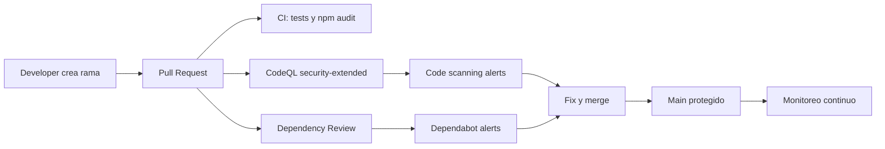

# Demo DevSecOps con GitHub Advanced Security

Demo lista para mostrar un flujo DevSecOps claro: codigo, pruebas, revision de seguridad, alertas, remediacion y gobierno en GitHub. La aplicacion es una API Node.js pequena y segura por defecto para que la audiencia vea el proceso sin necesitar casco antibalas.

## Historia de la demo

Una API de transferencias entra al flujo de delivery. Cada cambio pasa por controles automatizados:



## Que incluye

| Area | Archivo | Proposito |
| --- | --- | --- |
| Aplicacion segura | `src/app.js` | API Express con headers seguros, rate limit y validacion de entrada |
| Pruebas | `test/app.test.js` | Verifica health, autorizacion y validaciones |
| CI | `.github/workflows/ci.yml` | Instala dependencias, ejecuta pruebas y `npm audit` |
| SAST | `.github/workflows/codeql.yml` | CodeQL con queries `security-extended` y `security-and-quality` |
| Dependencias | `.github/workflows/dependency-review.yml` | Bloquea PRs con dependencias vulnerables |
| Dependabot | `.github/dependabot.yml` | PRs automaticos para npm, Docker y GitHub Actions |
| Supply chain | `.github/workflows/scorecard.yml` | OpenSSF Scorecard para postura del repo |
| Gobierno | `SECURITY.md`, `CODEOWNERS`, PR template | Politicas de reporte, ownership y checklist |

## Como ejecutar localmente

```powershell
npm install
npm test
npm run start
```

Endpoints:

```text
GET  /health
GET  /api/accounts/1001       Header: x-demo-user: demo-user
POST /api/transfers           Header: x-demo-user: demo-user
```

Ejemplo:

```powershell
curl.exe -H "x-demo-user: demo-user" http://localhost:3000/api/accounts/1001
```

## Como mostrar GitHub Advanced Security

1. Abrir **Settings > Code security and analysis**.
2. Activar, si esta disponible para la organizacion:
   - GitHub Advanced Security.
   - Code scanning.
   - Dependabot alerts.
   - Dependabot security updates.
   - Secret scanning y push protection.
3. Crear una rama y abrir un PR.
4. Mostrar los checks:
   - `ci`.
   - `CodeQL`.
   - `Dependency Review`.
   - `Scorecard`.
5. Abrir la pestana **Security** y explicar:
   - **Code scanning**: vulnerabilidades en codigo.
   - **Dependabot**: vulnerabilidades en librerias.
   - **Secret scanning**: prevencion de secretos antes del push.
   - **Security policy**: canal de reporte responsable.

## Mensaje ejecutivo para la demo

> GitHub Advanced Security mueve la seguridad al pull request: el equipo recibe feedback antes de mezclar codigo, prioriza hallazgos con contexto y reduce riesgo sin frenar el delivery. Exactamente lo que DevSecOps prometia antes de que alguien lo convirtiera en una slide de 47 capas.

## Guion recomendado

Usa `docs/guion-demo.md` para la lectura paso a paso.

